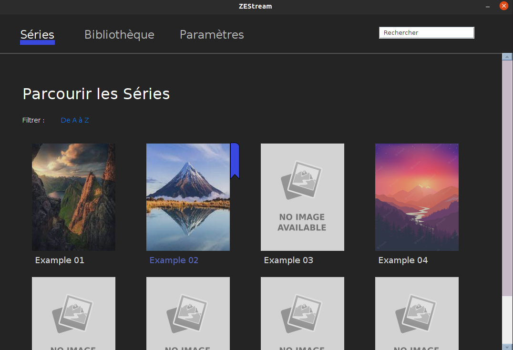
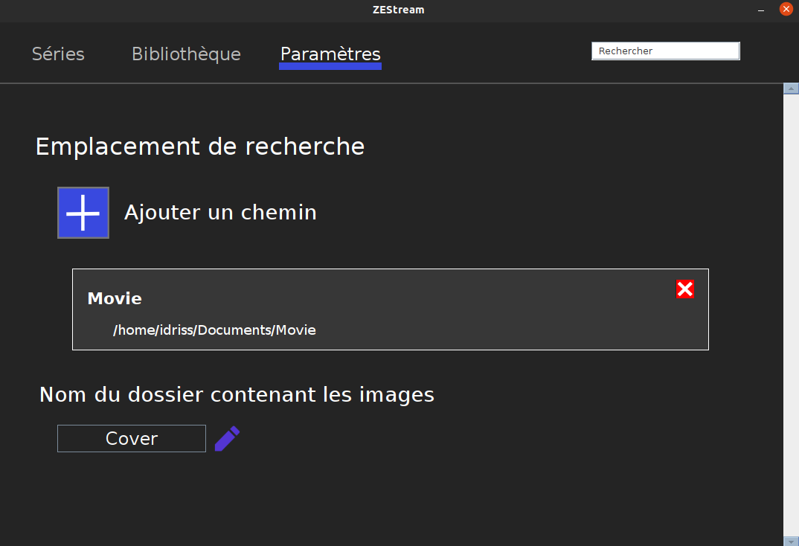

# ZEStream
***

ZEStream est un micro-logiciel proposant une interface graphique permettant de visionnée et de gérer ses  séries, Films et vidéos.
L'idée est simple plutôt que de parcourir ses dizaines voir centaines de dossiers et fichiers vidéos à l'aide du navigateurs de fichiers proposée par son SE (windows/linux) autant le faire sur un interface plus agréable.



</br>

## Mise en place

### Importer ses Vidéos
Il est nécéssaire dans un premier temps de spécifier le ou les emplacements de vos dossier contenant vos contenu vidéo.
Pour cela il faut ce rendre dans l'onglet Paramètres et ajouter les dossiers voulu en cliquant sur **+** 
Ainsi, vous pourrez centraliser vos fichiers vidéos sur une seul et même application.


</br>

Pour que vos fichiers et dossiers soit lu et afficher correctement, il est nécéssaire de respecter une architecture simple. 

Prenons ici par example mon dossier Movie visible sur l'image. Il devra être organisé de la façon suivante: 

```
Movie
│   
│ 
└─── Example 01
│   │   movie-example-01.mp4
|   |   movie-example-02.mp4
|   |   movie-example-03.mp4
│   │
│   └─── Cover
│       │   Example 01.jpg
│       
└─── Example 02
|   │   
|   |
|   └─── Cover
|   |   |   Example 02.jpg
|   |   |   part 01.jpg
|   |   |   part 02.jpg
|   |   
|   └─── part 01
|   |   |   movie-example-02-part01.mp4
|   |
|   └─── part 02
|   |   |   movie-example-02-part02.mp4
|   |
|   └───  ...
└─── ...

```

Mon dossier Movie contiendra donc les dossiers de mes films. Et dans chaque dossier de films, on pourra retrouver un dossier "Cover" qui contiendra les images des dossiers (Attention : les images doivent avoir **le même** nom que les dossiers pour que celle-ci soit affiché).
Ainsi on pourra créer une multitude de sous dossier.

> **ATTENTION** 
> * Si les vidéos sont à la racine du dossier (cf: Movie > Example 01) alors **UNIQUEMENT** des fichiers (vidéos) sont attendu. Le seul dossier accépté est celui contenant les images (ici le dossier *Cover*) 
> * Si vous choisisser d'organiser les vidéos dans des sous dossiers (cf: Movie > Example 02) alors **UNIQUEMENT** des dossiers sont attendu.  
> **NE PAS MELANGER FICHIERS ET DOSSIERS DANS UN MÊME SOUS DOSSIER**  

Pour résumer: 
Deux solution s'offrent a nous: 

1. Movie > Movie Example 01 > [fichies vidéos] + [Dossier Img]
2. Movie > Movie Example 02 > sous Dossier + [Dossier Img] > [fichiers videos]

### L'ajout de Cover

Comme vous l'avez compris il est possible d'ajouter des images pour chaque dossier créé. Il faudra cependant veuillez à nommer l'image avec le **MÊME** nom que le dossier auquel on veut attacher l'image.

Le dossier contenant les images des dossiers est nommée par défaut **"Cover"**. Il est également possible de changer ce nom s'il ne vous convient pas dans les paramètres.

> **NOTE** \
> Si aucun dossier "Cover" n'est créer et aucune image n'est ajouter alors une image par defaut sera ajouter. Mais cela ne gène en rien le bon fonctionement de l'application. 

## La Bibliotheque

Il va être possible d'ajouter des élements à la bibliothèque et d'enregistrer l'avancement des Séries/Film que vous regarder.


## Précision Générale
* Le dossier contenant les images des dossiers est nommée par défaut **"Cover"**
* Les vidéos sont éxecuter en fonction du lecteur vidéo définit par défaut sur votre machine. Il est possible qu'en fonction de l'extension de votre fichier différent lecteur soit lancé. 
