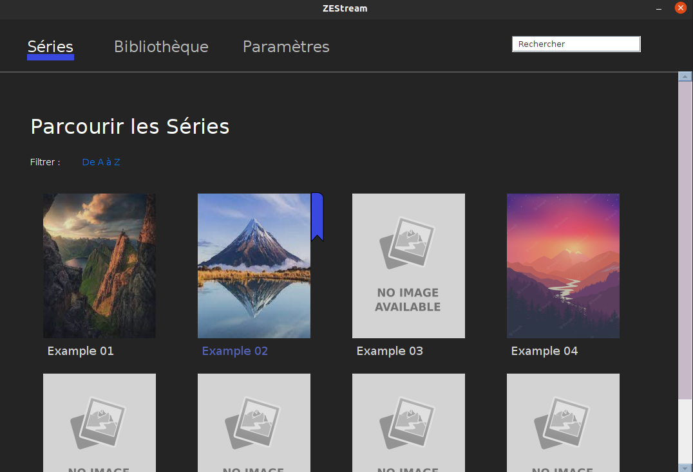
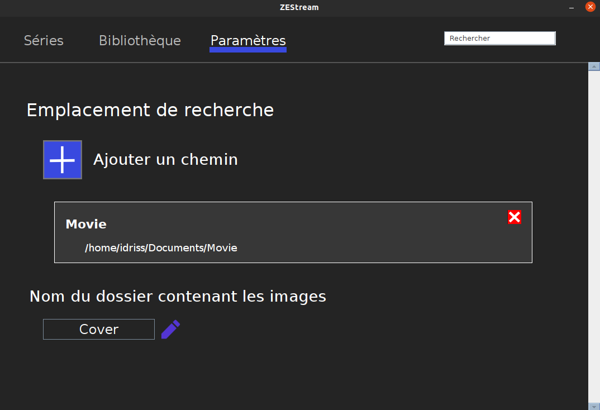
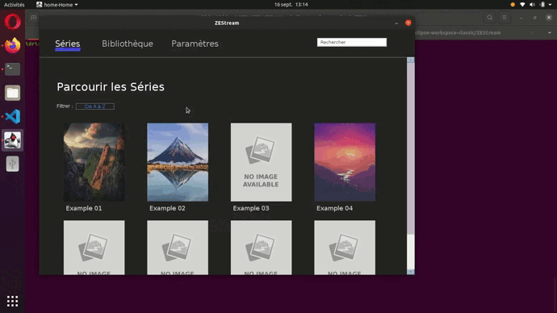
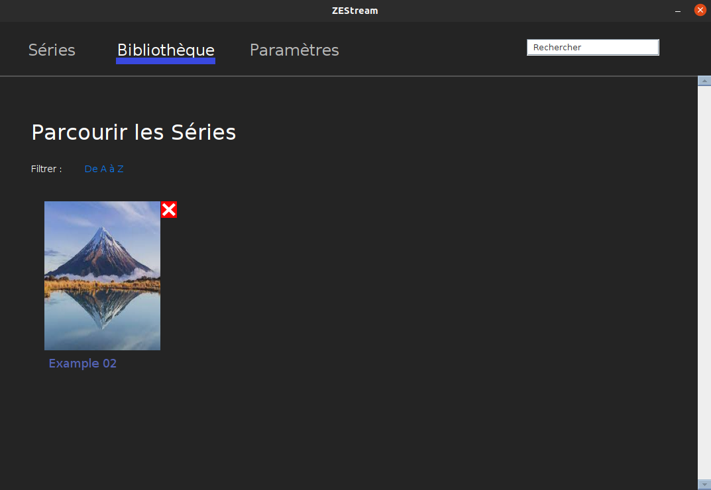

# ZEStream
***

ZEStream est un micrologiciel proposant une interface graphique permettant de visionner et de gérer ses  séries, Films et vidéos.

L'idée est simple, plutôt que de parcourir ses dizaines voir centaines de dossiers et fichiers vidéo à l'aide du navigateur de fichiers proposé par son SE (Windows/Linux) il serait plus simple de le faire sur une interface plus agréable.


</br>

## Mise en place

### Importer ses Vidéos

Il est nécessaire dans un premier temps de spécifier le ou les emplacements de vos dossiers contenant vos contenus vidéo.
Pour cela il faut se rendre dans l'onglet Paramètres et ajouter les dossiers voulus en cliquant sur le '+'. 

Ainsi, vous pourrez centraliser vos fichiers vidéo sur une seule et même application.


</br>

Pour que vos fichiers et dossiers soient lus et affichés correctement, il est nécessaire de respecter une architecture simple. 

Prenons ici par exemple mon dossier Movie visible sur l'image. Il devra être organisé de la façon suivante: 

```
Movie
│   
│ 
└─── Example 01
│   │   movie-example-01.mp4
|   |   movie-example-02.mp4
|   |   movie-example-03.mp4
│   │
│   └─── Cover
│       │   Example 01.jpg
│       
└─── Example 02
|   │   
|   |
|   └─── Cover
|   |   |   Example 02.jpg
|   |   |   part 01.jpg
|   |   |   part 02.jpg
|   |   
|   └─── part 01
|   |   |   movie-example-02-part01.mp4
|   |
|   └─── part 02
|   |   |   movie-example-02-part02.mp4
|   |
|   └───  ...
└─── ...

```

Mon dossier Movie contiendra donc les dossiers de mes films. Et dans chaque dossier de films, on pourra retrouver un dossier "Cover" qui contiendra les images des dossiers (Attention : les images doivent avoir **le même** nom que les dossiers pour que celles-ci soient affichées).
Ainsi on pourra créer une multitude de sous-dossiers.

> **ATTENTION** 
> * Si les vidéos sont à la racine du dossier (cf: Movie > Example 01) alors **UNIQUEMENT** des fichiers (vidéos) sont attendus. Le seul dossier accepté est celui contenant les images (ici le dossier *Cover*) 
> * Si vous choisissez d'organiser les vidéos dans des sous-dossiers (cf: Movie > Example 02) alors **UNIQUEMENT** des dossiers sont attendus.  
>
> **NE PAS MELANGER FICHIERS ET DOSSIERS DANS UN MÊME SOUS-DOSSIER**  

Pour résumer vous avez deux possibilités: 

1. Movie > Movie Example 01 > [fichiers vidéos] + [Dossier Img]
2. Movie > Movie Example 02 > sous-dossier + [Dossier Img] > [fichiers videos]

### L'ajout de Cover

Comme vous l'avez compris il est possible d'ajouter des images pour chaque dossier créé. Il faudra cependant veiller à nommer l'image avec le **MÊME** nom que le dossier auquel on veut attacher l'image.

Le dossier contenant les images des dossiers est nommé par défaut **"Cover"**. Il est également possible de changer ce nom s'il ne vous convient pas dans les paramètres.

> **NOTE** \
> Si aucun dossier "Cover" n'est crée et aucune image n'est ajoutée alors une image par défaut sera ajoutée. Mais cela ne gène en rien le bon fonctionnement de l'application. 

## La Bibliothèque

Il va être possible d'ajouter des éléments à la bibliothèque et d'enregistrer l'avancement des Séries/Films que vous regardez.



En effectuant un clique droit sur un fichier vidéo, on l'ajoute automatiquement à la bibliothèque. Le fichier sera alors affiché en rouge. 

De plus, le chemin jusqu'au fichier sera mis en évidence à l'aide d'une couleur différente pour les titres (en l'occurrence bleue) sous les images des dossiers.
Une icône s'affichera également à côté des images dans l'onglet *Séries* lorsque la série a déjà été ajoutée à la bibliothèque.



Une fois une série ou un Film terminé il pourra être retiré de la bibliothèque en cliquant sur la petite icône supprimer.


## Précision Générale
* Le dossier contenant les images est nommé par défaut **"Cover"**
* Les vidéos sont exécutées en fonction du lecteur vidéo défini par défaut sur votre machine. Il est possible qu'en fonction de l'extension de votre fichier, différent lecteur soit lancé. 

## Execution
